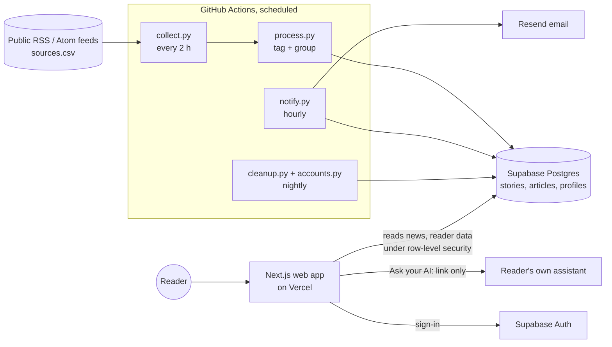

# Architecture

## Data flow

1. **Collect** (`pipeline/collect.py`): read each feed in `sources.csv` (news sites, Reddit, and official YouTube channel feeds for video); store headline, up to 280 characters of the feed's own summary, link, time, feed categories, and the link to the outlet's own picture if the feed gives one (never the image). Full-text fields are never read. A re-worded headline replaces the old one and is marked with `title_updated_at`.
2. **Tag** (`pipeline/tagging.py`): places from `pipeline/data/places.json` (whole-word English, substring Telugu/Hindi so suffixes like -లో still match; ambiguous names only count with Telangana context), topics from `topics.json` plus the feed's own category, plus the subject of a section feed (`sources.csv` column `topics`, e.g. every report from a film site or an outlet's sports feed), a wire-copy key from the opening text.
3. **Embed** (`pipeline/embed.py`): `intfloat/multilingual-e5-small` (100 languages incl. Telugu and Hindi). Fallback: character n-grams, same-language only.
4. **Group** (`pipeline/process.py`): each new article joins the most similar story updated within 72 hours if its cosine similarity to both the story's running mean and the story's first report is ≥ threshold (0.905 multilingual, 0.52 lexical), else starts a new one. The first-report check stops a story's mean drifting towards "news in general" and swallowing unrelated reports. After changing the rule, run Collect news with **regroup** ticked (articles are kept, stories rebuilt).
5. **Refresh story**: label = earliest headline, plus the earliest per language (the app shows one in the reader's language); counts, languages, source kinds; places kept if ≥40% of reports name them; scope local/state/national, or international when no Indian place is named and at least half the reports come from world-news feeds (`sources.csv` layer `international`); topics kept if ≥30% of reports carry them.
6. **Read** (web app): three tabs. International = scope international; National = every Indian story (central, nationwide and all states); State = the reader's state, narrowed by a separate district multi-select (none or all ticked = whole state). Filters by topics or own interests (text search), languages, kinds of source, hide-crime. Order: most sources, latest, or seeded random.
7. **Notify**: once a day at the reader's time: followed-story updates, then city/district, state, India; top 5 each by source count; headlines as published.
8. **Retain**: articles deleted after 30 days (counts kept in `coverage_counts`); empty stories removed; inactive accounts warned at ~11 months, deleted 30 days later unless used.

## Security model (supabase/migrations/20261001000200_app.sql)

| Data | Guests | Signed-in reader | Pipeline (database owner) |
| --- | --- | --- | --- |
| sources, stories, articles | read | read | read/write |
| vectors, runs, coverage_counts | none | none | read/write |
| profiles, follows | none | own rows only | read (emails, retention) |
| source_suggestions | none | add + read own | read |

Tested by `supabase/tests/rls_test.sql` on every push.

## Why these choices

- **Scheduled batch, not streaming:** matches "news at your time", costs nothing on free tiers, easy to reason about.
- **Rules as data files:** places and topics are editable JSON, so tagging stays transparent and changeable without code.
- **Links only for AI:** keeps rule 2 absolute; the product never generates text a reader sees.
- **Sample-data mode:** the app runs without any account, so design and testing are never blocked on setup.
- **Postgres-compatible SQL everywhere:** the same pipeline code runs on SQLite for local tests and on Supabase in production; CI runs both.
